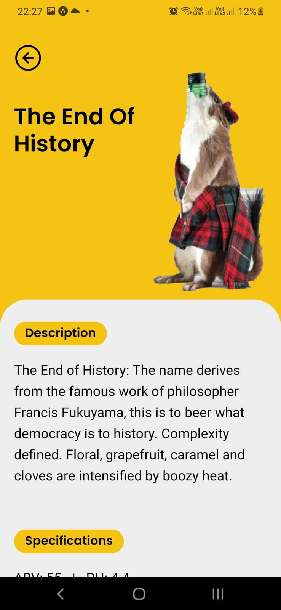

<p align="center">
  
</p>

<!-- <p align="center">
  <a href="#-tecnologias">Tecnologias</a>&nbsp;&nbsp;&nbsp;|&nbsp;&nbsp;&nbsp;
  <a href="#-layout">Layout</a>&nbsp;&nbsp;&nbsp;|&nbsp;&nbsp;&nbsp;
  <a href="#memo-licença">Licença</a>
</p> -->

# BarBrew

Bem-vindo(a) ao BarBrew, um projeto de mostruário de cervejas. Nesse projeto é possível navegar e procurar por diversas cervejas da cervejaria BrewDog, através da [Punk API v2](https://punkapi.com/documentation/v2). 

Esse projeto faz parte do desafio proposto pela Garupa de um projeto de um mostruário de cervejas, utilizando React Native.


## 🚀 Principais Funcionalidades

- Utilização do Redux para gerenciamento de estado global;
- Listagem de cervejas sob demanda, utilizando recursos de paginação;
- Busca pelo nome das cervejas;
- Tela de detalhes de cada cerveja

## ⚠️ Requisitos para a instalação
```
## Para ver a versão do node:
node -v
```

[Como instalar o node em qualquer sistema operacional](https://efficient-sloth-d85.notion.site/Instalando-o-Node-js-d40fdabe8f0a491eb33b85da93d90a2f)


## 👣 Passo a passo para rodar o projeto em sua máquina

1 - Para clonar o projeto:
```
git clone git@github.com:joaoD3V/barbrew.git
```

### Para rodar o projeto react native

1 - Para instalar as dependências do projeto:
```
npm install
```
2 - Para rodar o projeto:
```
npm run start
```

### Para rodar os testes automatizados
1 - Para rodar todos os testes:
```
npm run test
```
2 - Para rodar todos os testes em modo watch:
```
npm run test:watch
```
2 - Para analisar a cobertura dos teste:
```
npm run test:coverage
```


---

Feito com ♥ by joaoD3V